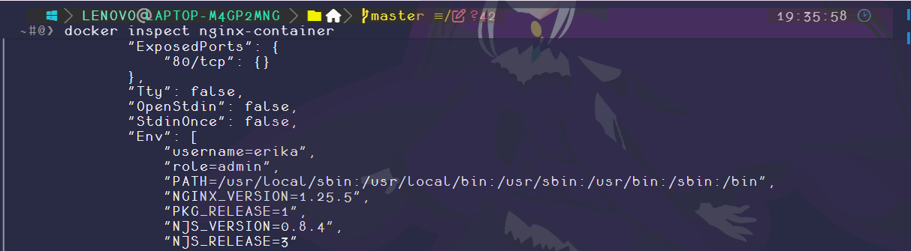
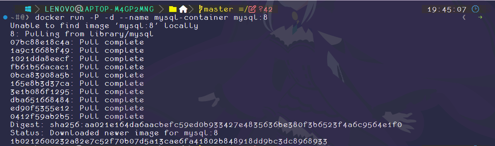
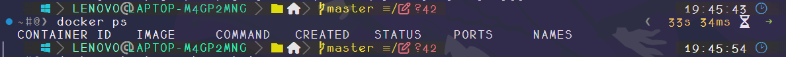
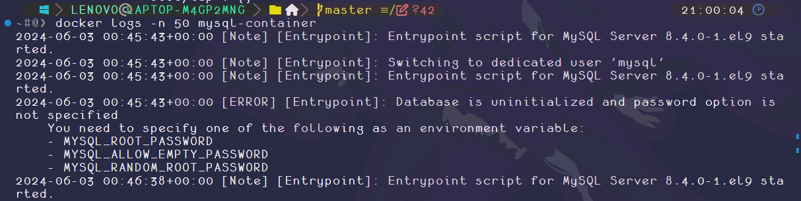
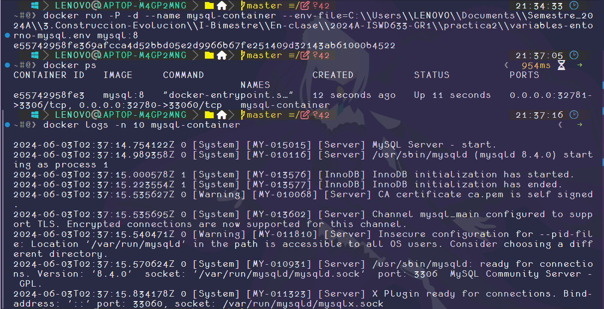

# Variables de Entorno
### ¿Qué son las variables de entorno?
- Las variables de entorno son variables dinámicas donde su valor puede proceder de diversas fuentes: archivos de texto, gestores secretos de terceros, scripts de llamada, etc.
# COMPLETAR

### Para crear un contenedor con variables de entorno

```
docker run -d --name <nombre contenedor> -e <nombre variable1>=<valor1> -e <nombre variable2>=<valor2>
```

### Crear un contenedor a partir de la imagen de nginx:alpine con las siguientes variables de entorno: username y role. Para la variable de entorno rol asignar el valor admin.

```
docker run -d --name nginx-container -e username=erika -e role=admin nginx:alpine
```

# COMPLETAR

# CAPTURA CON LA COMPROBACIÓN DE LA CREACIÓN DE LAS VARIABLES DE ENTORNO DEL CONTENEDOR ANTERIOR



### Crear un contenedor con mysql:8 , mapear todos los puertos

# COMPLETAR
```
docker run -P -d --name mysql-container mysql:8  
```
### ¿El contenedor se está ejecutando?
- El contenedor no se encuentra en ejecución
# COMPLETAR

### Identificar el problema
- Utilizando el comando para ver los logs de un contenedor se puede identificar el error:
```
docker logs -n 50 mysql-container
```
>"*La base de datos **no está inicializada** y **no se ha especificado la opción de contraseña**. Es necesario especificar una de las siguientes como **variable de entorno**:*". 
- Es decir, la especificación de la variable de entorno en la base de datos es necesaria.
# COMPLETAR

### Eliminar el contenedor creado con mysql:8 
```
docker rm mysql-container
```
# COMPLETAR


### Para crear un contenedor con variables de entorno especificadas
- Portabilidad: Las aplicaciones se vuelven más portátiles y pueden ser desplegadas en diferentes entornos (desarrollo, pruebas, producción) simplemente cambiando el archivo de variables de entorno.
- Centralización: Todas las configuraciones importantes se centralizan en un solo lugar, lo que facilita la gestión y auditoría de las configuraciones.
- Consistencia: Asegura que todos los miembros del equipo de desarrollo o los entornos de despliegue utilicen las mismas configuraciones.
- Evitar Exposición en el Código: Mantener variables sensibles como contraseñas, claves API, y tokens fuera del código fuente reduce el riesgo de exposición accidental a través del control de versiones.
- Control de Acceso: Los archivos de variables de entorno pueden ser gestionados con permisos específicos, limitando quién puede ver o modificar la configuración sensible.

Previo a esto es necesario crear el archivo y colocar las variables en un archivo, **.env** se ha convertido en una convención estándar, pero también es posible usar cualquier extensión como **.txt**.
```
docker run -d --name <nombre contenedor> --env-file=<nombreArchivo>.<extensión> <nombre imagen>
```
**Considerar**
Es necesario especificar la ruta absoluta del archivo si este se encuentra en una ubicación diferente a la que estás ejecutando el comando docker run.

### Crear un contenedor con mysql:8 , mapear todos los puertos y configurar las variables de entorno mediante un archivo

```
docker run -P -d --name mysql-container --env-file=C:\\Users\\LENOVO\\Documents\\Semestre_2024A\\3.Construccion-Evolucion\\I-Bimestre\\En-clase\\2024A-ISWD633-GR1\\practica2\\variables-entorno-mysql.env mysql:8
```

# COMPLETAR


# CAPTURA CON LA COMPROBACIÓN DE LA CREACIÓN DE LAS VARIABLES DE ENTORNO DEL CONTENEDOR ANTERIOR 


### ¿Qué bases de datos existen en el contenedor creado?
- La base de datos MYSQL

# COMPLETAR