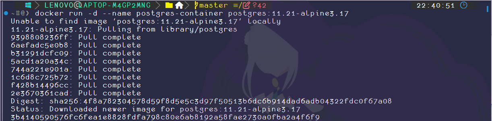
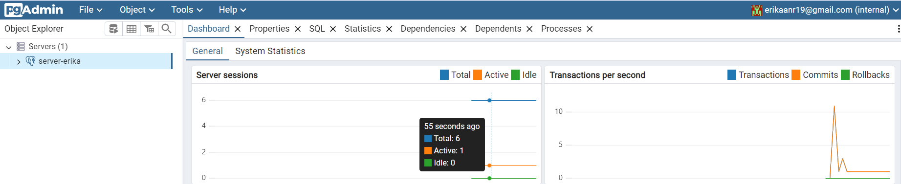
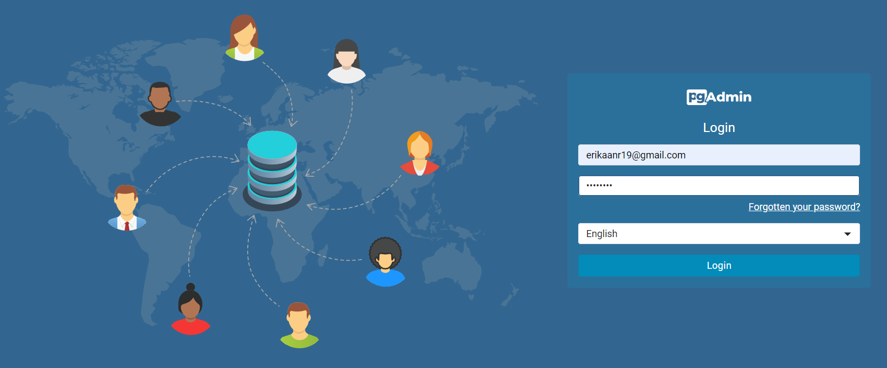
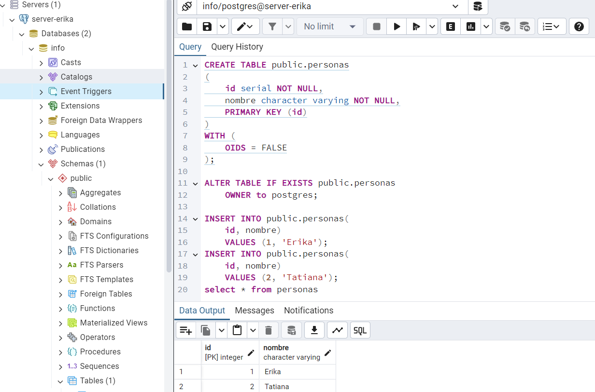

### Crear contenedor de Postgres sin que exponga los puertos. Usar la imagen: postgres:11.21-alpine3.17

```
docker run -d --name postgres-container postgres:11.21-alpine3.17
```

# COMPLETAR

### Crear un cliente de postgres. Usar la imagen: dpage/pgadmin4
```
#crear una red en docker
docker network create pg-network
```
```
## Levantar un contenedor de PostgreSQL
docker run -d --name postgres-con --network pg-network -e POSTGRES_PASSWORD=admin123 postgres:11.21-alpine3.17
```
```
#levantar un contenedor pgAdmin4
docker run -d --name my_pgadmin --network pg-network -p 80:80 -e PGADMIN_DEFAULT_EMAIL=erikaanr19@gmail.com -e PGADMIN_DEFAULT_PASSWORD=admin123 dpage/pgadmin4
```

# COMPLETAR

La figura presenta el esquema creado en donde los puertos son:
- a: 80
- b: 80
- c: 5432


## Desde el cliente
### Acceder desde el cliente al servidor postgres creado.

# COMPLETAR CON UNA CAPTURA DEL LOGIN

### Crear la base de datos info, y dentro de esa base la tabla personas, con id (serial) y nombre (varchar), agregar un par de registros en la tabla, obligatorio incluir su nombre.
## Desde el servidor postgresl
### Acceder al servidor
### Conectarse a la base de datos info
# COMPLETAR
### Realizar un select *from personas
# AGREGAR UNA CAPTURA DE PANTALLA DEL RESULTADO
