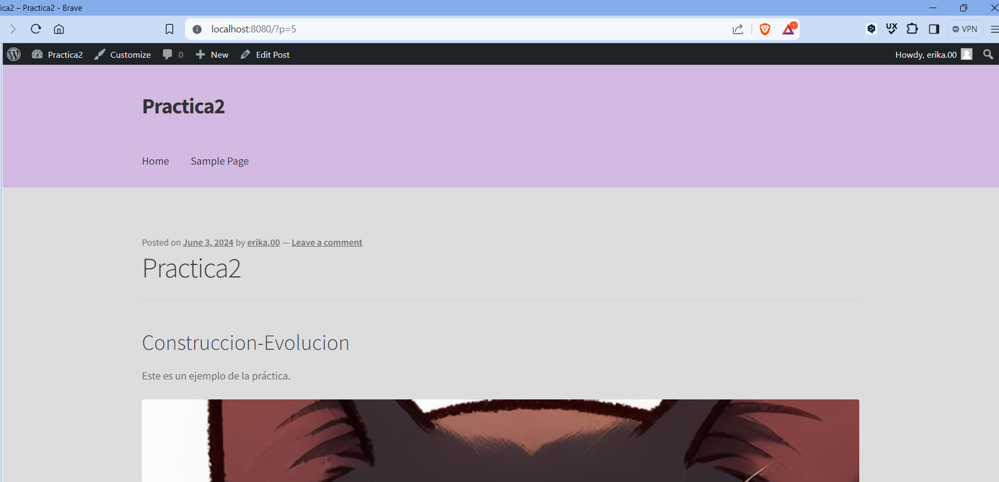

## Esquema para el ejercicio


### Crear la red
# COMPLETAR
```
docker network create net-wp -d bridge 
```
### Crear el contenedor mysql a partir de la imagen mysql:8, configurar las variables de entorno necesarias
# COMPLETAR
```
docker run --name container-mysql --network net-wp --env-file=C:\\Users\\LENOVO\\Documents\\Semestre_2024A\\3.Construccion-Evolucion\\I-Bimestre\\En-clase\\2024A-ISWD633-GR1\\practica2\\ve-mysql.env -d mysql:8
```
### Crear el contenedor wordpress a partir de la imagen: wordpress, configurar las variables de entorno necesarias
# COMPLETAR
```
docker run --name container-wp --network net-wp --env-file=C:\\Users\\LENOVO\\Documents\\Semestre_2024A\\3.Construccion-Evolucion\\I-Bimestre\\En-clase\\2024A-ISWD633-GR1\\practica2\\ve-wp.env -p 8080:80 -d wordpress
```

De acuerdo con el trabajo realizado, en la el esquema de ejercicio el puerto a es **8080**

Ingresar desde el navegador al wordpress y finalizar la configuración de instalación.
# COLOCAR UNA CAPTURA DE LA CONFIGURACIÓN

Desde el panel de admin: cambiar el tema y crear una nueva publicación.
Ingresar a: http://localhost:8080/ 
recordar que a es el puerto que usó para el mapeo con wordpress
# COLOCAR UNA CAPTURA DEL SITO EN DONDE SEA VISIBLE LA PUBLICACIÓN.

### Eliminar el contenedor wordpress
# COMPLETAR
```
docker stop container-wp
```
```
docker rm container-wp
```
### Crear nuevamente el contenedor wordpress
Ingresar a: http://localhost:8080/ 
recordar que a es el puerto que usó para el mapeo con wordpress
```
docker run --name container-wp --network net-wp --env-file=C:\\Users\\LENOVO\\Documents\\Semestre_2024A\\3.Construccion-Evolucion\\I-Bimestre\\En-clase\\2024A-ISWD633-GR1\\practica2\\ve-wp.env -p 8080:80 -d wordpress
```

### ¿Qué ha sucedido, qué puede observar?
# COMPLETAR
- Existe un error: The theme directory "storefront" does not exist.


